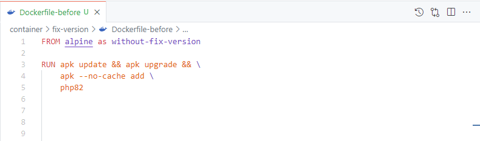
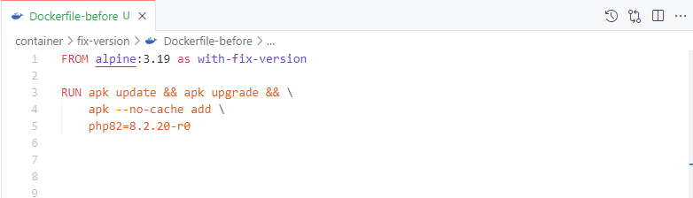
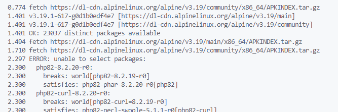
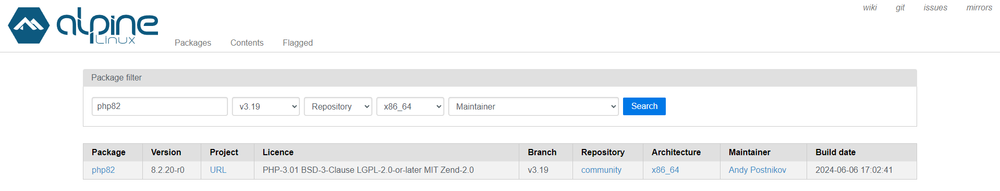

# A importância de fixar a versão da instalação dos pacotes em um container docker

Fala galera, tudo bem? Bora falar sobre um assunto importante para quem mexe com Docker: a importância de fixar a versão dos pacotes. Isso aí pode parecer chato e desnecessário, mas é essencial para evitar dor de cabeça no futuro.

Vou te passar um caso que vivenciei recentemente que quebrou todo meu pipeline e me deu uma dor de cabeça, desnecessária.

## Meu caso mais antigo sem definir uma versão
Há alguns anos utilizei uma imagem da comunidade disponível no dockerhub, poxa a poc que eu estava fazendo funcionou perfeitamente,então, adicionei ela direto no meu deploy, mal sabia que além de funcionar maravilhosamente bem, estava arrumando para a cabeça do meu eu do futuro. 

Alguns meses depois da aplicação funcionando, DO NADA, parou de funcionar e eu não sabia nem por onde começar, não sabia o que tinha acontecido, procurava até debaixo do tapete e nada de achar a causa raiz. Sim, meu processo de observabilidade não era tão maduro naquela época.

Depois de algumas horas arrancando tufos dos meus cabelos (figurativamente ta gente???), acabei encontrando outro problema, a aplicação da comunidade tinha sido alterada, o autor que disponibilizou ela atualizou a "latest". Aqui parei para refletir: Ué, sempre usar a última versão não é uma boa prática, não é o recomendado? Pois é pequeno gafanhoto, fomos enganados.

Ainda, para solucionar o problema eu voltei a imagem na "versão" anterior e tudo voltou a funcionar.

Que sufoco. O problema foi resolvido, agora porque a aplicação foi atualizada e como? 

Comecei a investigar esse ponto e encontrei o motivo meu deploy estava utilizando um "imagePullPolicy: Always" no kubernetes, esse ponto irei discutir em outro momento. Mas já adianto, se está utilizando isso em seu deploy, troque por "ifNotPresent", vai te poupar de várias outras coisas também que você nem imagina que possa dar problema. **De onde veio esse tem muito mais!**

# Antes de tudo como assim fixar uma versão?

Vamos ver como fazemos para fixar essas versões nos Dockerfiles, vou te mostrar um exemplo antes e após fixar a versão, explicando cada ponto.

### Aqui está um Dockerfile sem fixar a versão:

-**Base Image**: FROM alpine – Aqui estamos usando a imagem mais recente do Alpine disponível. Pode mudar com o tempo.

-**Instalação do PHP**: apk --no-cache add php82 – Esse comando vai instalar a versão mais recente do PHP 8.2 disponível no repositório. Pode variar dependendo de quando a build for executado.

### Aqui está com Dockerfile com versões fixadas

-**Base Image Específica**: FROM alpine:3.19 – Aqui fixamos a versão da imagem base do Alpine para 3.19. Garantimos que estamos sempre usando essa versão específica.

-**Instalação do PHP com Versão Fixada**: apk --no-cache add php82=8.2.20-r0 – Agora, estamos instalando exatamente a versão 8.2.20-r0 do PHP 8.2. Isso evita surpresas e mudanças indesejadas.

## O Problema da Variabilidade
Então, o lance é o seguinte: se você não fixa as versões dos pacotes, cada vez que você reconstrói um container, pode acabar pegando versões diferentes dos pacotes. E aí, meu amigo, começam os problemas. Atualizações pode trazer mudanças que quebra seu código ou introduzir novos bugs.

## Exemplos de Problemas Comuns
- Compatibilidade de Dependências: Às vezes, um pacote depende de uma versão específica de outro pacote, se um deles atualizar e o outro não, já era.
- Mudanças de API: Novas versões podem mudar como você deve usar o pacote, o que pode quebrar sua aplicação.
- Bugs Introduzidos: Atualizações pode trazer novos bugs. 

Sim, isso acontece! Olha aqui... No momento da build da imagem quebrou.

ERROR... palavrinha que mais vejo por aí rsrsrs...

## Benefícios de Fixar Versões
- Consistência: Fixar as versões dos pacotes garante que o ambiente de desenvolvimento, testes e produção seja o mesmo. Isso é bom porque você sabe que se funcionou em um lugar, vai funcionar nos outros também.
- Reprodutibilidade: A cada build vai gerar o mesmo resultado. Isso é crucial para um deploy tranquilo e sem surpresas.
- Segurança: Você também pode aplicar patches de segurança de maneira controlada. Se você sabe exatamente quais versões está usando, fica mais fácil identificar e corrigir vulnerabilidades.

## Meu caso mais recente mesmo definindo uma versão
Mesmo aprendendo da pior maneira, a minha nova imagem docker continha o alpine fixado na versão 3.19 com o php8.2 na versão 8.2.19-r0, coisinha de ai ai meu deus, tô seguindo as boas práticas né? Pois é, só que não!

Olhe na imagem abaixo percebe que a data de build do pacote php82 na versão 8.2.20-r0 foi realizada no dia 06/06/2024

Essa nova versão de build corrigiu 3 vulnerabilidades de segurança, sendo: 

- [https://cve.mitre.org/cgi-bin/cvename.cgi?name=CVE-2024-4577](https://cve.mitre.org/cgi-bin/cvename.cgi?name=CVE-2024-4577)
- [https://cve.mitre.org/cgi-bin/cvename.cgi?name=CVE-2024-5458](https://cve.mitre.org/cgi-bin/cvename.cgi?name=CVE-2024-5458)
- [https://cve.mitre.org/cgi-bin/cvename.cgi?name=CVE-2024-5585](https://cve.mitre.org/cgi-bin/cvename.cgi?name=CVE-2024-5585)

Vocês podem conferir diretamente no commit do registry do alpine 
[https://git.alpinelinux.org/aports/commit/?id=a7abe5f43dd2884bec684cf11f794dc8854fdba4](https://git.alpinelinux.org/aports/commit/?id=a7abe5f43dd2884bec684cf11f794dc8854fdba4), pow bacana, menos 3 problemas para nos preocuparmos e o que isso tem de errado? Nada.

Mas ocorreu das builds da imagem que estavam utilizando a versão "8.2.19-r0" quebrarem, simplesmente porque "removeram" a versão que eu estava utilizando.

O que me deixou de cabelo em pé é segurança... que de certa forma fiquei extremamente feliz porque parou de funcionar o deploy. Sim, porque parou de funcionar e não estou louco.

Simplesmente, porque tive a oportunidade entender o que ocorreu e me levou a conclusão dos seguintes pontos:

## Conclusão
- Fixando as versões têm um controle maior sobre a minha imagem docker.
- Não tenho surpresas de um "componente" ou "biblioteca" mudar o comportamento.
- #ArrumeiParaCabeca... Precisarei atualizar a versão das bibliotecas e garantir a compatibilidade com o software kkkk
- Estou seguindo a boa práticas 
- Após atualizar o software continuou funcionando como o esperado <3

## Indagação

Ainda, mesmo fixando a versão e sabendo que meu software vai se comportar da mesma maneira em diversos ambientes, que não terei tantas emoções e surpresas com algo que não tenho o controle diretamente, me levou a fritar nos seguintes pontos.

- Quem disse que só por eu seguir uma boa prática o software está seguro?
- Nesse caso fizeram o bem, corrigiram algumas CVE's e fizeram um patch de correção.
- Se no caso de uma correção de vulnerabilidade, fosse realmente a introdução de um bug?
- Se fosse a introdução de uma vulnerabilidade? Nunca pensei por esse lado, pois sempre atualizo os softwares para as últimas versões e não "vejo" realmente o que tá sendo alterado.

Poxa, agora colocando na balança, o fato dele ter "deletado" a tag foi boa, pois pude ver a mudança que ocorreu

E se ele simplesmente "deletasse" a tag e coloca-se outra no lugar? 0.0

Isso me leva a acreditar que eu não estou programando sozinho, que o container não é só meu, estou trabalhando com um desconhecido, como posso confiar nele? Será que posso confiar?

Poxa, ficarei sem respostas e fritando para achar uma resposta... não somente de como me proteger de bugs e vulnerabilidades, mas também de um "desconhecido" manipular o meu "software".
